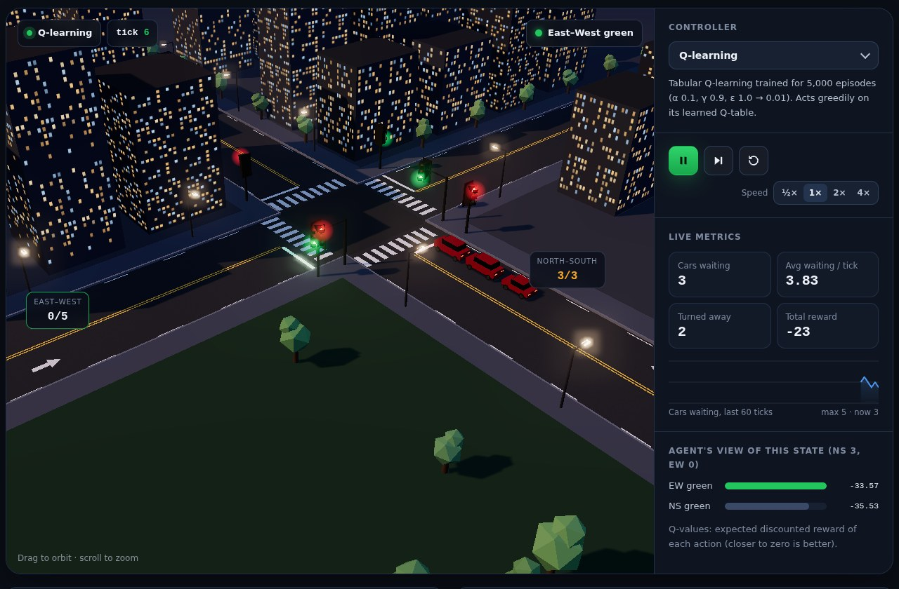
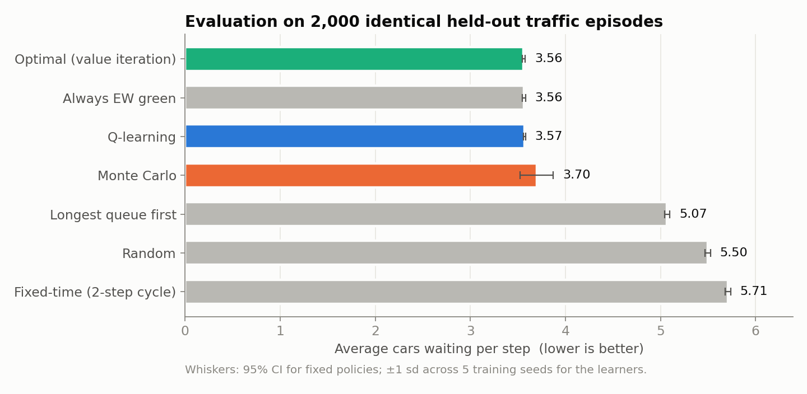
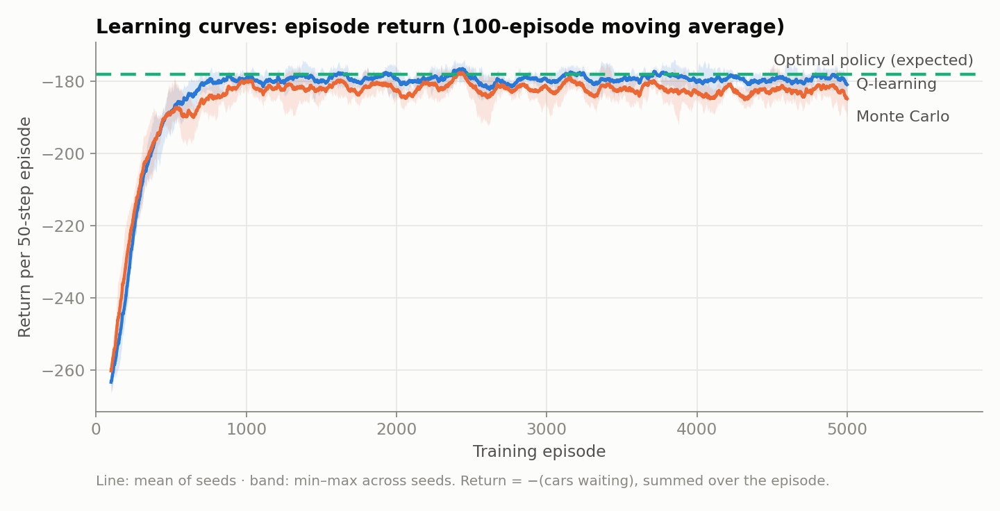
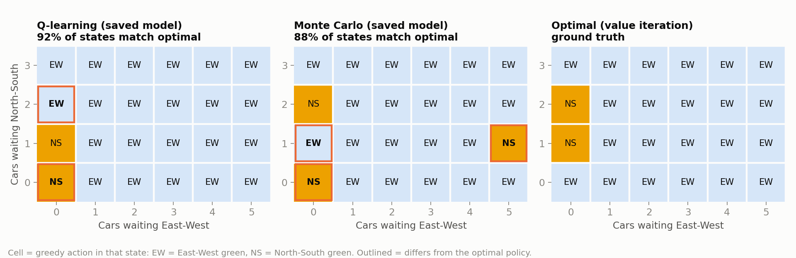
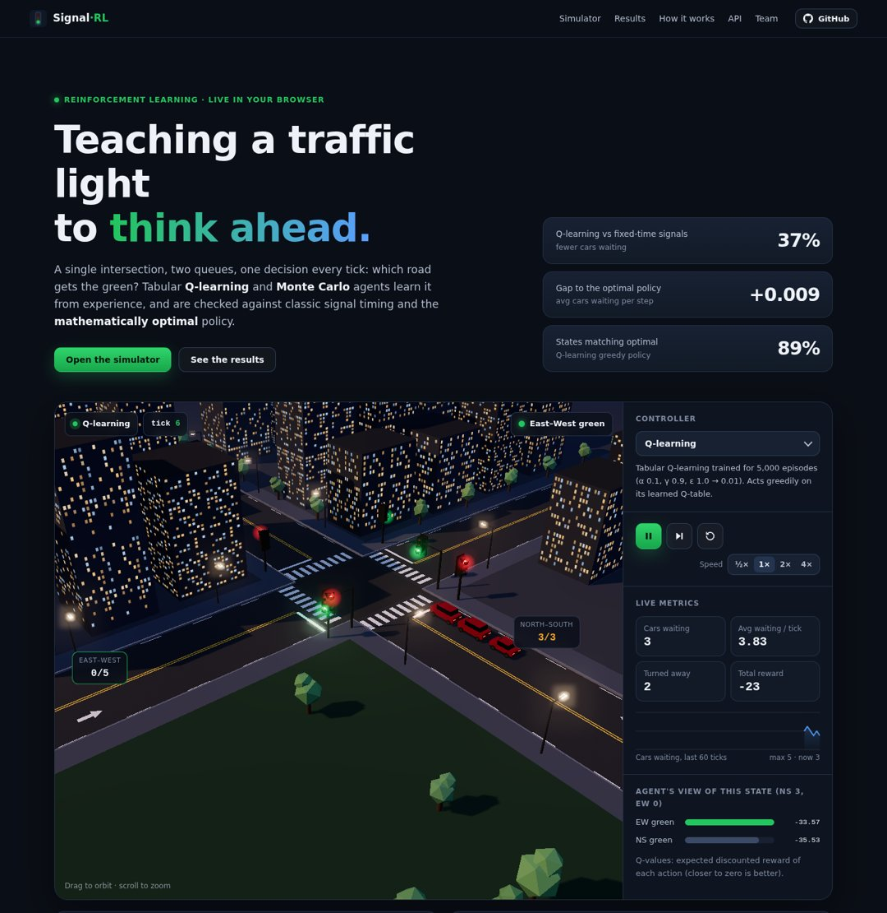

<div align="center">

# 🚦 RL Traffic Signal Control

**Teaching a traffic light to think ahead: Q-learning and Monte Carlo agents that decide which road gets the green.**

A custom Gymnasium intersection · tabular Q-learning and first-visit Monte Carlo control · exact optimal policy by value iteration · a 3D browser simulator with a JSON API

### [🚦 Live demo: rl-traffic-signal-control.vercel.app](https://rl-traffic-signal-control.vercel.app/#simulator)

[](https://vercel.com/new/clone?repository-url=https%3A%2F%2Fgithub.com%2Falokekissac%2FRL-Traffic-Signal-Control&project-name=rl-traffic-signal-control)


</div>



---

## 📑 Contents

[Overview](#-overview) · [Results](#-results) · [Key finding](#-key-finding-the-reward-can-be-gamed) · [The MDP](#-the-problem-as-an-mdp) · [Algorithms](#-algorithms) · [3D simulator](#-3d-web-simulator) · [API](#-api) · [Run locally](#-run-locally) · [Deploy](#%EF%B8%8F-deploy-to-vercel) · [Structure](#%EF%B8%8F-project-structure) · [Team](#-team)

---

## 🔭 Overview

Fixed-time traffic lights switch on a timer, whatever the traffic is doing. This project asks whether a signal can instead **learn** when to switch, purely from experience, by treating each decision as a step in a Markov decision process.

- **Environment:** a Gymnasium intersection with a North–South and an East–West queue, random arrivals and departures, and a reward of minus the number of cars waiting.
- **Agents:** tabular **Q-learning** (temporal-difference) and **first-visit Monte Carlo control**, trained with the hyperparameters from our report.
- **Ground truth:** the state space is small (24 states), so the MDP is also solved **exactly with value iteration**. Every learned policy is scored against the true optimum, not just against weak baselines.
- **Fair evaluation:** 5 independent training seeds per algorithm, 2,000 held-out episodes, and **common random numbers**, so every controller faces exactly the same traffic.
- **Web app:** a 3D night-time intersection built with Three.js, where you can switch controllers live, run a benchmark in the browser and query the agents through a JSON API.

This began as our **Reinforcement Learning CA2 group project** at Dublin Business School ("Optimising traffic light decisions to reduce waiting time and congestion"). This repository is a cleaned-up, reproducible version of it: see [What changed from the coursework](#-what-changed-from-the-coursework). The original group report is in [`docs/RL_CA2_Report_Traffic_Signal_Control.pdf`](docs/RL_CA2_Report_Traffic_Signal_Control.pdf).

---

## 📊 Results

Average number of cars waiting per tick on 2,000 held-out 50-tick episodes (lower is better). Learner rows are the mean of 5 training seeds.

| Controller | Avg cars waiting ↓ | 95% CI / sd | Cars turned away per tick | States matching optimal |
|---|---:|---:|---:|---:|
| 🟢 **Optimal (value iteration)** | **3.561** | ±0.017 | 0.961 | – |
| Always East–West green | 3.564 | ±0.016 | 0.974 | – |
| 🔵 **Q-learning** | **3.570** | sd 0.009 | 0.972 | 89% |
| 🟠 **Monte Carlo (first-visit)** | **3.699** | sd 0.173 | 0.813 | 86% |
| Optimal, overflow-aware (see below) | 3.833 | ±0.022 | 0.572 | – |
| Longest queue first | 5.070 | ±0.028 | 0.491 | – |
| Random | 5.496 | ±0.030 | 0.561 | – |
| Fixed-time (2-tick cycle) | 5.708 | ±0.029 | 0.510 | – |

**Headlines**
- Q-learning comes within **0.009 cars** of the true optimum and has **37% fewer cars waiting** than fixed-time signals.
- Q-learning is also far more **consistent**: its spread across seeds is 0.009, compared with 0.173 for Monte Carlo.
- Both learners beat the classic actuated rule (longest queue first) by roughly 1.4–1.5 cars per tick.

<table>
<tr>
<td width="50%"></td>
<td width="50%"></td>
</tr>
</table>



**Learning dynamics.** Both agents converge within about 1,000 episodes. Q-learning then tracks the optimal return closely. Monte Carlo sits slightly below it and is noisier, because it waits for full-episode returns, which have high variance.

### Hyperparameter experiments

The two experiments from our report, re-run properly across 5 seeds:

| Run | Algorithm | α | γ | ε₀ → ε_min | ε decay | Episodes | Avg waiting ↓ (± sd) | Matches optimal |
|---|---|---:|---:|---:|---:|---:|---:|---:|
| Report settings | Q-learning | 0.1 | 0.9 | 1.0 → 0.01 | 0.995 | 5,000 | **3.570 ± 0.009** | 89% |
| Report settings | Monte Carlo | 0.1 | 0.9 | 1.0 → 0.01 | 0.995 | 5,000 | 3.699 ± 0.173 | 86% |
| Experiment 1 | Q-learning | 0.2 | 0.3 | 1.0 → 0.03 | 0.456 | 500 | 4.061 ± 0.448 | 65% |
| Experiment 1 | Monte Carlo | 0.2 | 0.3 | 1.0 → 0.03 | 0.456 | 500 | 3.993 ± 0.242 | 69% |
| Experiment 2 | Q-learning | 0.3 | 0.45 | 0.5 → 0.02 | 0.564 | 500 | 3.874 ± 0.281 | 69% |
| Experiment 2 | Monte Carlo | 0.3 | 0.45 | 0.5 → 0.02 | 0.564 | 500 | 4.153 ± 0.118 | 60% |

With an ε decay of 0.456 or 0.564 per episode, exploration effectively stops after about 5–6 episodes, and the short horizon (γ 0.3 or 0.45) makes the agents myopic. Both experiments end up **worse and much less reliable** than the report settings, which confirms that the original choice of slow ε decay and γ = 0.9 was the right one.

<sub>All numbers come from <code>python train.py</code> and are saved in <code>results/results.json</code> and <code>results/results.md</code>.</sub>

---

## 🔍 Key finding: the reward can be gamed

The optimal policy keeps **East–West green almost all the time**, and "always East–West green" scores within 0.003 of the optimum. Why?

Queues are capped (3 cars North–South, 5 East–West). A car that arrives at a full queue simply **leaves the model**, and the reward, −(cars waiting), never counts it. So the cheapest strategy is to let the short North–South road fill up and turn cars away: that road can never contribute more than 3 to the penalty. The agents found this loophole, and it shows in the "turned away" column: about 0.97 cars per tick.

As an extension, `TrafficIntersectionEnv(overflow_penalty=2.0)` charges 2 points for every car turned away. Under that reward:

| Controller | Avg waiting | Turned away / tick |
|---|---:|---:|
| Optimal, original reward | 3.561 | 0.961 |
| **Optimal, overflow-aware** | 3.833 | **0.572** (−40%) |
| Q-learning trained with overflow penalty (5 seeds) | 3.873 ± 0.041 | 0.577 |

The overflow-aware policy serves North–South even when it holds 3 cars, accepting slightly longer queues in exchange for turning away 40% fewer cars. Q-learning finds that policy too (91% of states match). The lesson: **in RL, the reward is the specification.** You can compare both behaviours in the simulator.

---

## 🧮 The problem as an MDP

| | |
|---|---|
| **State** | `(ns, ew)`: cars waiting North–South (0–3) and East–West (0–5), 24 states |
| **Action** | `0` = East–West green, `1` = North–South green |
| **Dynamics** | each tick: 0–2 cars arrive on each road (uniform); the green road discharges 1–2 cars (uniform); queues are capped |
| **Reward** | `−(ns + ew)` after the tick, so every waiting car costs a point (optionally `− penalty × cars turned away`) |
| **Episode** | 50 decisions from a random starting state (time limit, so learners bootstrap through it) |

`traffic_rl/env.py` also builds the **exact transition model** P(s′, r | s, a), which the tests check against the simulator empirically.

---

## 🤖 Algorithms

| | Q-learning | First-visit Monte Carlo | Value iteration |
|---|---|---|---|
| Type | Off-policy TD control | On-policy MC control | Dynamic programming |
| Update | after every step: `Q ← Q + α[r + γ·max Q(s′,·) − Q]` | after every episode: sample average of first-visit returns | Bellman optimality backups until Δ < 1e-10 |
| Needs a model? | No | No | Yes (exact) |
| Exploration | ε-greedy, ε 1.0 → 0.01, decay 0.995 per episode | same | – |
| Role here | learner | learner | ground truth |

**Baselines:** random, fixed-time (alternates every 2 ticks), longest queue first (actuated), and always East–West.

---

## 🌃 3D web simulator



- **Live 3D intersection** (Three.js with bloom and shadows): cars queue, drive through on green, and flash red when turned away from a full queue.
- **Switch controllers on the fly:** Q-learning, Monte Carlo, optimal, overflow-aware optimal, longest queue, fixed-time or random.
- **Agent's-eye view:** the Q-values of the current state, updated every tick.
- **Live metrics:** cars waiting, running average, cars turned away, total reward, and a 60-tick sparkline.
- **Ask the agent:** set any queue state and call the `/api/decide` endpoint.
- **In-browser benchmark:** every controller on 400 identical episodes, ranked in about a second.
- Results, figures and the hyperparameter tables are rendered from `results/results.json`.

The browser runs the same environment dynamics as `traffic_rl/env.py`, using the Q-tables exported to `models/`.

---

## 🔌 API

| Endpoint | Description |
|---|---|
| [`GET /api/decide?ns=2&ew=4&policy=q_learning`](https://rl-traffic-signal-control.vercel.app/api/decide?ns=2&ew=4&policy=q_learning) | Greedy action, Q-values and whether it matches the optimal action |
| `POST /api/decide` with body `{"ns": 3, "ew": 1, "policy": "monte_carlo"}` | Same, with a JSON body |
| `GET /api/policies` | All Q-tables |
| `GET /api/results` | Evaluation results |
| `GET /api/health` | Liveness check |

`policy` is one of `q_learning`, `monte_carlo`, `optimal` or `optimal_overflow_aware`. Out-of-range or malformed input returns HTTP 400 with a readable message:

```json
{ "error": "'ns' must be between 0 and 3 (got 9)" }
```

---

## 🚀 Run locally

```bash
git clone https://github.com/alokekissac/RL-Traffic-Signal-Control.git
cd RL-Traffic-Signal-Control
python -m venv .venv && source .venv/bin/activate
pip install -r requirements-dev.txt

python app.py                 # web app on http://localhost:5000 (uses the trained models in models/)
python train.py               # re-run every experiment: 5 seeds, a few minutes on a laptop
python train.py --quick       # smoke test
pytest                        # 18 tests: environment, exact model, agents, API
```

`notebooks/walkthrough.ipynb` is an executed, single-seed tour of the whole pipeline.

---

## ☁️ Deploy to Vercel

Click **Deploy with Vercel** at the top, or import the repo at [vercel.com/new](https://vercel.com/new). There's nothing to configure:

- `app.py` at the root is detected as a Flask app. It only needs Flask, so the function stays tiny.
- `public/` (JS, CSS, figures) is served from Vercel's CDN.
- The trained models (`models/*.json`) and results ship with the function, so there's no training or database at deploy time.
- `vercel.json` and `.vercelignore` keep the training code, notebooks and tests out of the bundle.

---

## 🗂️ Project structure

```
.
├── app.py                    # Flask app + JSON API (Vercel entrypoint)
├── train.py                  # All experiments → models/, results/, figures
├── make_figures.py           # Figures for the README and the website
├── traffic_rl/
│   ├── env.py                # Gymnasium environment + exact transition model
│   └── agents.py             # Q-learning, Monte Carlo, value iteration, baselines, evaluation
├── models/                   # Trained Q-tables (JSON)
├── results/                  # results.json, results.md, learning curves
├── templates/index.html      # Web app page
├── public/static/            # 3D scene (Three.js), app logic, styles, figures
├── notebooks/walkthrough.ipynb
├── original/                 # The original coursework notebook, unchanged
├── tests/                    # pytest suite
└── docs/                     # figures, screenshots, original group report (PDF)
```

---

## 🔄 What changed from the coursework

The original CA2 notebook (kept unchanged in `original/`) trained Q-learning for 1,000 episodes and served it through a Flask demo. For this version I:

- **Implemented first-visit Monte Carlo control**, which the report described but the notebook didn't include.
- Rebuilt the environment as a proper **Gymnasium** env with seeding and an exact transition model, keeping the same dynamics.
- Added **value iteration**, fair **baselines**, **multi-seed** training and **common-random-number** evaluation, and re-ran both report experiments.
- Found and documented the **turned-away-cars loophole**, and added the overflow-aware reward.
- **Fixed the demo:** it had a hard-coded override of the agent's choice, lit both roads green at once, and crashed on out-of-range input. It is now a 3D simulator with a validated API.
- Added **tests**, an executed notebook, and Vercel deployment.

---

## 👥 Team

Reinforcement Learning, CA2 group project, Dublin Business School:

- **Aloke Kunjandi Issac**
- Anamika Koonakkampilly Sunilal
- Deninson David Jeyakumar
- Muhammed Fayiz Kizhakkumparamban
- Irene Ann Jacob

Repository, rebuild and web app maintained by **Aloke**, AI Engineer & Full-Stack Developer · Dublin, Ireland
[GitHub](https://github.com/alokekissac) · [LinkedIn](https://www.linkedin.com/in/alokekisssac/)
